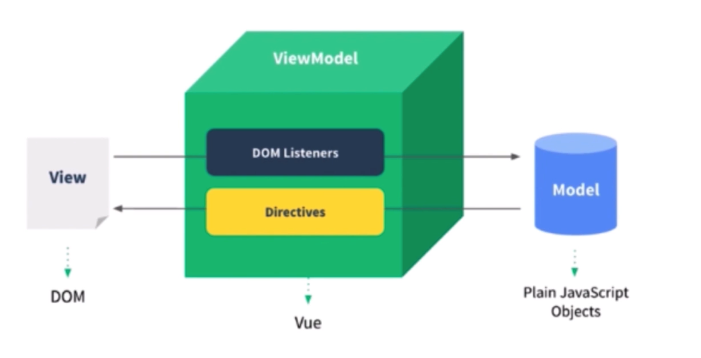

# Vue - 2

------

## 组件化

+ “很久之前” 就有组件化
+ 数据驱动视图（MVVM）

1. 传统组件，只是静态渲染，更新还要依赖于操作 DOM
2. 数据驱动视图 - Vue MVVM

## 响应式

组件 `data` 的数据一旦发生变化，立即触发视图的更新

+ 核心 API - `Object.defineProperty`
+ `Object.defineProperty` 的一些缺点（Vue 3.0 启用 `Proxy`）
  1. `Proxy` 兼容性不好

## vdom 和 diff

## 模板编译

## 渲染过程

## 前端路由

